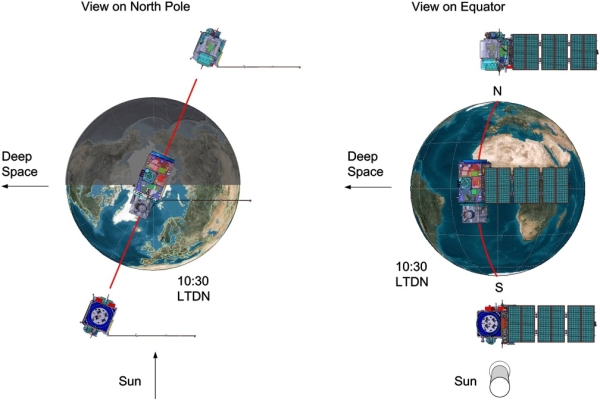
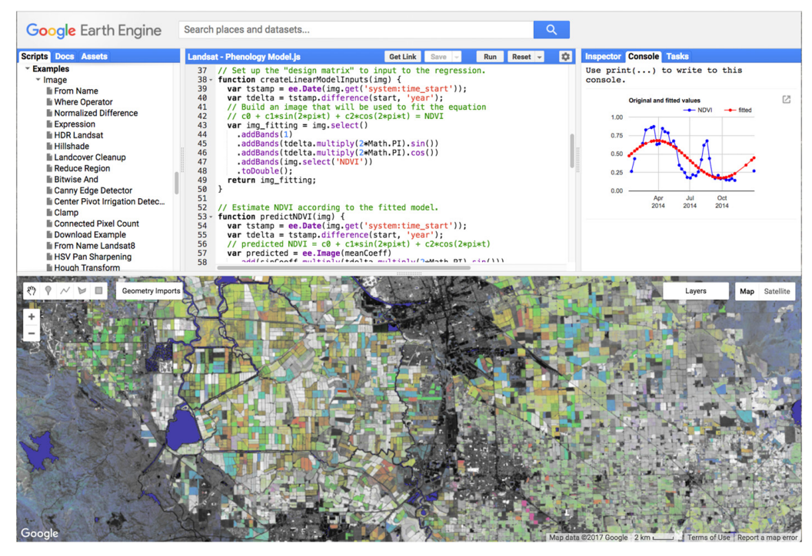

# Sentinel-2
### A Powerful Multispectral Sensor for Urban & Environmental Monitoring
UCL CASA0023 – Week 2 Presentation

---

## What is Sentinel-2?

- Twin satellites (Sentinel-2A & 2B) launched by the European Space Agency under Copernicus Programme
- 13 spectral bands (from visible to shortwave infrared)
- Spatial resolutions: **10m**, **20m**, **60m** depending on band
- Revisit time: **5 days**
- Open and free data policy

Image source: <a href="https://sentiwiki.copernicus.eu/web/s2-mission" target="_blank">Copernicus SentiWiki</a>

---

## Why is Sentinel-2 special?

- Combines **high spatial**, **temporal**, and **spectral resolution**
- Covers large areas efficiently while maintaining detail
- Especially valuable for urban, agricultural, and environmental monitoring

> I think Sentinel-2 stands out for its balance — not too coarse, not too slow, and very information-rich.

---

## Urban Monitoring Applications

- Detecting **urban expansion**, land cover transitions, impervious surfaces
- Used in cities like Lagos, Jakarta, London for detailed mapping
- Time series analysis enables change detection across years

> Example: Forkuor et al. (2018) used Sentinel-2 for urban classification in West Africa with high accuracy.

---

## Agriculture & Vegetation Monitoring

- NDVI, EVI, NDWI and red-edge bands support crop health analysis
- Short revisit time allows for **phenological tracking**
- Helps predict yields, detect drought stress, and monitor forest degradation

> Sentinel-2 has become critical for precision agriculture.

---

## Machine Learning & Land Cover Classification

- Sentinel-2 often used with classifiers like **Random Forest** and **SVM**
- Input for automated land cover products in platforms like **Google Earth Engine**
- Useful in creating consistent, high-resolution land use maps

Image source: Gorelick et al. (2017)

> Sentinel-2 data works especially well in GEE-based classification workflows due to its regular revisit time and spectral depth.

---

## Reflection – What I Learned

- Understanding sensors isn’t just about specs, but about **how and why** they’re used
- Sentinel-2’s versatility makes it a go-to choice for many urban & environmental questions
- The real power lies in the way we apply the data, not just in the sensor itself

> This project helped me think methodologically — matching the right tool to the research goal.

---

## Reflection – Future Use & Value

- I see great potential to use Sentinel-2 in:
  - Urban green infrastructure assessment
  - Monitoring environmental justice patterns
  - Integrating with SAR (e.g. Sentinel-1) for multimodal analysis

> The sensor’s richness makes it ideal for advanced research workflows.

---

## References

Forkuor, G., Dimobe, K., Serme, I. and Tondoh, J.E., 2018. Landsat-8 vs. Sentinel-2: examining the added value of Sentinel-2’s red-edge bands to land-use and land-cover mapping in Burkina Faso. *GIScience & Remote Sensing*, 55(3), pp.331–354.

Gorelick, N., Hancher, M., Dixon, M., Ilyushchenko, S., Thau, D. and Moore, R., 2017. Google Earth Engine: Planetary-scale geospatial analysis for everyone. *Remote Sensing of Environment*, 202, pp.18–27. https://doi.org/10.1016/j.rse.2017.06.031

European Space Agency (ESA) Sentinel-2 Mission Overview: https://sentinels.copernicus.eu/web/sentinel/missions/sentinel-2

